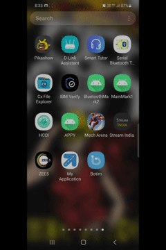
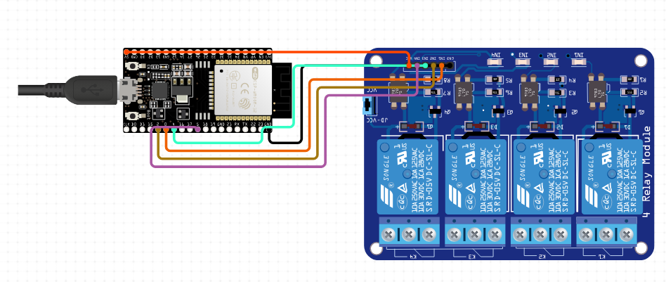
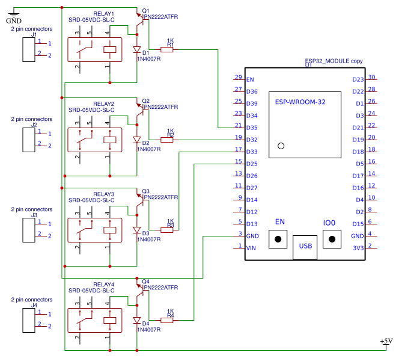

# GeoBlaze-ESP32
IoT-based Smart Vehicle Indicator Automation System powered by ESP32 &amp; Bluetooth Serial
 
### *An IoT-based Smart Vehicle Indicator Automation System*

[🔗 View Android App Repository → GeoBlaze-Android](https://github.com/<your-username>/GeoBlaze-Android)

---

## 📘 Overview
**GeoBlaze** is an IoT-driven system that **automates vehicle turn indicators** using real-time navigation data.  
The ESP32 acts as a **slave microcontroller**, receiving Bluetooth commands from the Android app, which fetches turn information from Google Maps.  
Based on incoming commands, the ESP32 activates relays that control the **vehicle’s left and right turn indicators**.

This project demonstrates seamless **vehicle-electronics integration** using Bluetooth Serial Communication and is designed for **real-time safety automation** in urban navigation.

---

## ⚙️ Architecture

| Component | Role |
|------------|------|
| **Android App (Master)** | Fetches turn data from Google Maps and sends control signals (`L` / `R`) via Bluetooth |
| **ESP32 (Slave)** | Receives signals and activates corresponding GPIO pins connected to relay module |
| **Relay Module** | Controls the left and right indicator circuits based on GPIO signals |

---

## 🔌 Pin Configuration

### ESP32 ↔ Relay Module
| ESP32 Pin | Relay Pin |
|------------|------------|
| Vin | Vin |
| GPIO13 | IN1 |
| GPIO12 | IN2 |
| GPIO4 | IN3 |
| GPIO2 | IN4 |
| GND | GND |

### Relay ↔ Vehicle Indicators
| Relay | Connection | Description |
|--------|-------------|-------------|
| RELAY1 NO | Left indicator +ve | Turns ON left signal |
| RELAY1 COMMON | Left indicator -ve | Ground |
| RELAY2 NO | Right indicator +ve | Turns ON right signal |
| RELAY2 COMMON | Right indicator -ve | Ground |

---

## 🧰 Hardware Requirements
- ESP32 microcontroller  
- 2/4-channel relay module  
- Vehicle indicator lights  
- Power supply: 5V–12V depending on setup, better to use converter if providing direct connection from bike's battery (12V to 5V converter).
- Android phone with GeoBlaze App installed  

---

## 🧩 Software Requirements
- Arduino IDE or PlatformIO  
- ESP32 board package installed  
- Bluetooth Serial library (default in ESP32)  

---

## 🚀 Setup Instructions
1. Clone this repository:
```bash
   git clone https://github.com/Zia-Mahmood/GeoBlaze-ESP32.git
````

2. Open the `.ino` file in Arduino IDE.
3. Select **Board → ESP32 Dev Module**.
4. Flash the code to your ESP32.
5. Power the relay module and ESP32.
6. Pair your Android device with the ESP32 via Bluetooth.
7. Launch the **GeoBlaze App** and select the paired ESP32 device.
8. Start navigation — indicators will turn ON/OFF automatically based on route turns.

---

## 🧪 Demo
| Type                         | Link                                                                                       |
| ---------------------------- | ------------------------------------------------------------------------------------------ |
| 📱 App Interaction Video     | [Google Drive Link](https://drive.google.com/file/d/REPLACE_APP_DEMO_ID/view?usp=sharing)  |
| 🏍️ Real Bike Implementation | [Google Drive Link](https://drive.google.com/file/d/REPLACE_BIKE_DEMO_ID/view?usp=sharing) |
| ⚡ Circuit Diagram            | `media/GeoBlaze_Circuit.png` *(local image placeholder)*                                   |
| 🧭 Pin Layout Diagram        | `media/GeoBlaze_PinLayout.png` *(local image placeholder)*                                 |


### 📱 App Interaction
[Google Drive Link](https://drive.google.com/file/d/1WtmUDDjg7xVTShBiGUPVRhIEMigdYvJX/view?usp=sharing)



---

### 🏍️ Real Bike Implementation 
[Google Drive Link](https://drive.google.com/file/d/1k_8Ny_jzUUArPhIODR5X-xLXiLAKU4JY/view?usp=sharing)


---

### ⚡ Circuit Diagram


---

### 🧭 Pin Layout Diagram

---

## 🛠️ Testing

* Send `'48'` (alias for L) from Serial Monitor → Left indicator lights up.
* Send `'50'` (alias for R) → Right indicator lights up.
* App sends these commands automatically during navigation.

---

## 🧱 Repository Structure

```
GeoBlaze-ESP32/
├── src/
│   └── main.ino
├── media/
│   ├── app-demo.mp4
│   ├── bike-demo.mp4
│   ├── Circuit.png
│   └── PinLayout.png
├── LICENSE
└── README.md
```
---

## 💬 Issues & Contributions

Found a bug or want to suggest an improvement?
Open an issue [here](https://github.com/Zia-Mahmood/GeoBlaze-ESP32/issues).
All contributions are welcome!

---

## 🔭 Future Scope

* Integrate **WiFi-based telemetry** for remote monitoring
* Add **hazard light automation** on sudden stops
* Implement **cloud logging** for driving behavior analysis
* Add **proximity sensors** for lane-change signaling

---

## 📜 License

This project is licensed under the [MIT License](LICENSE).

---

## 👨‍💻 Maintainer

**Zia Mahmood Hussain**
[LinkedIn](https://www.linkedin.com/in/zia-mahmood-hussain/) • [GitHub](https://github.com/Zia-Mahmood)

